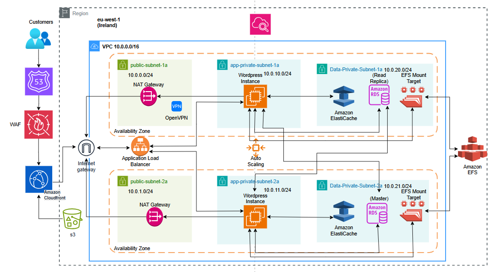

# AWS Yüksek Trafik Web Sitesi Mimarisi

Bu proje, hosting-101.com için AWS bulut altyapısı tasarımını içermektedir. Site, anlık 10.000+ ziyaretçi trafiğine sahip yüksek trafik alan bir web portalıdır.

## 📊 Mimari Diyagramı

## 💰 Maliyet Hesaplaması

> **AWS Calculator Linki detaylı bilgiler için:** [AWS Calculator](https://calculator.aws/#/estimate?id=180b7c0784ba849390d52ce78f270add28a4e431)

## 🎯 Proje Genel Bakışı

Bu proje, **WordPress** altyapısı üzerine kurulu, **MariaDB** veritabanı ve **Memcached** önbellek sistemi kullanan büyük bir portalı hedeflemektedir. Yaklaşık **30GB** büyüklüğündeki bu site, farklı coğrafyalardan gelen eş zamanlı siber saldırılarla sürekli karşı karşıyadır. **Google SEO puanı** ve **sayfa yükleme hızı** projenin kritik başarı faktörleri arasında yer alıyor.

## ⚡ Temel Gereksinimler

| Gereksinim | Açıklama |
|------------|----------|
| **WordPress Altyapısı** | Portal, WordPress içerik yönetim sistemi üzerinde çalışmaktadır |
| **Trafik Yönetimi** | Tanıtım dönemlerinde anlık trafik 10.000'lere ulaşabilmektedir |
| **Veritabanı ve Önbellek** | MariaDB veritabanı ve Memcached önbellek sistemi kullanılmaktadır |
| **Site Büyüklüğü** | Yaklaşık 30GB veri barındırmaktadır |
| **Güvenlik** | Farklı ülkelerden ve IP adreslerinden eş zamanlı ve sürekli güvenlik saldırılarına karşı etkin koruma sağlanması |
| **Performans** | Yüksek Google SEO puanı ve hızlı sayfa yükleme süreleri kritik öneme sahiptir |

## 🛠️ Kullanılan AWS Servisleri

Projenin gereksinimlerini karşılamak ve yüksek performanslı, güvenli ve ölçeklenebilir bir yapı oluşturmak için aşağıdaki AWS servisleri kullanılmıştır:

### 🖥️ Amazon EC2 (Elastic Compute Cloud)
-  WordPress uygulamasını barındıran sanal sunucular sağlamak için kullanılır
-  Otomatik ölçeklendirme gruplarının temelini oluşturur

### ⚖️ Elastic Load Balancing (ELB)
-  Gelen web trafiğini birden fazla EC2 örneği arasında otomatik olarak dağıtır
-  Yüksek erişilebilirlik ve hata toleransı sağlayarak uygulama kararlılığını artırır
-  Trafik artışlarında otomatik ölçeklendirme ile entegre çalışır

### 💾 Amazon RDS for MariaDB (Relational Database Service)
-  Yönetilen bir MariaDB veritabanı hizmeti sunar
-  Veritabanı kurulumu, yamalama, yedekleme ve ölçeklendirme gibi operasyonel görevleri basitleştirir
-  MariaDB'nin tüm özelliklerinden yararlanarak günlük yedekleme imkanı sunar

### 🌐 Amazon Route 53
-  Web sitesi için güvenilir ve ölçeklenebilir DNS hizmeti sunar
-  Alan adı yönlendirmelerini yönetir ve trafik rotalama politikalarını destekler

### 🛡️ AWS WAF (Web Application Firewall)
-  Web uygulamalarına yönelik yaygın web saldırılarına (SQL enjeksiyonu, XSS vb.) karşı koruma sağlar
-  CloudFront ile entegre çalışarak gelen trafiği filtreler

### ☁️ Amazon CloudFront
-  İçerik dağıtım ağı (CDN) olarak görev yapar
-  Statik ve dinamik içerikleri kullanıcılara coğrafi olarak en yakın konumdan sunarak sayfa yükleme hızını artırır
-  DDoS saldırılarına karşı birincil savunma katmanı görevi görür

### 📦 Amazon Simple Storage Service (S3)
-  Medya dosyaları (resimler, videolar vb.) ve yedekler gibi statik içerikler için yüksek ölçeklenebilir, dayanıklı ve uygun maliyetli depolama sağlar

### ⚡ Amazon ElastiCache (Memcached)
-  Veritabanı üzerindeki yükü azaltmak ve sık erişilen verileri hızlı bir şekilde sunmak için Memcached önbellek motoru olarak kullanılır
-  Uygulamanın genel performansını ve yanıt süresini iyileştirir

### 📁 Amazon Elastic File System (EFS)
-  Birden fazla EC2 örneği tarafından erişilebilen ve ölçeklenebilen paylaşımlı dosya depolama alanı sağlar
-  Özellikle WordPress gibi çoklu sunuculu ortamlarda medya dosyaları ve tema/eklenti paylaşımı için idealdir
